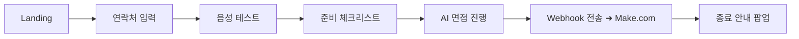
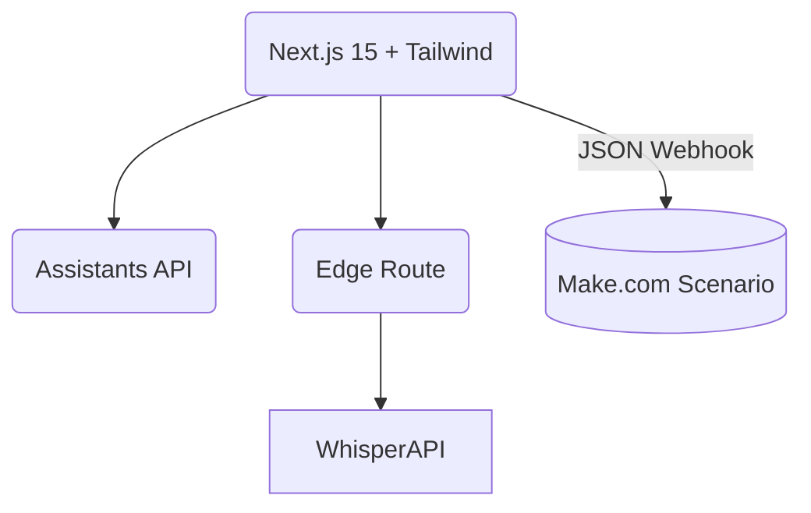

# AI 면접 프로그램 PRD

**버전 1.1 (최종)**  **작성일** 2025-05-13  **작성자** Product Manager

---

## 1. 제품 개요

| 항목          | 내용                                                                                                                                                     |
| ------------- | -------------------------------------------------------------------------------------------------------------------------------------------------------- |
| **목적**      | 지원자에게 실전과 유사한 AI 모의 면접을 제공해 준비 시간을 단축하고, 면접 로그·요약본을 조직(또는 HR 담당자)에게 자동 전달하여 평가 효율을 극대화합니다. |
| **핵심 가치** | • 실시간 음성 인터랙션<br>• Whisper 기반 고정밀 음성 인식<br>• 요약본 자동 생성 및 **Make.com** 연동                                                     |
| **범위**      | 웹 기반 SPA(데스크톱·모바일 대응) · 싱글 사용자 · 별도 로그인 없이 연락처만 수집 · 브라우저 로컬에 임시 데이터 저장 후 Webhook 전송 후 즉시 파기         |

---

## 2. 대상 사용자

| 구분          | 세부 설명                                                                                             |
| ------------- | ----------------------------------------------------------------------------------------------------- |
| **Primary**   | 채용 준비 중인 대학생·취준생 / 경력직 지원자                                                          |
| **Secondary** | HR·헤드헌터·교육기관                                                                                  |
| **Needs**     | - 실제 면접과 유사한 질문·압박감 경험<br>- 장비·환경 셀프 체크<br>- 면접 직후 텍스트 로그·요약본 확보 |

---

## 3. 사용자 흐름



### 3.1 단계별 상세 과정

| 단계       | 화면                | 사용자 액션                                                                                           | 시스템 동작                                                                                                                                                      | 다음 단계 조건           |
| ---------- | ------------------- | ----------------------------------------------------------------------------------------------------- | ---------------------------------------------------------------------------------------------------------------------------------------------------------------- | ------------------------ |
| **Step 1** | **랜딩 페이지**     | - 서비스 소개 확인<br>- '시작하기' 버튼 클릭                                                          | - 서비스 소개 및 기능 안내<br>- 시작하기 버튼 활성화                                                                                                             | '시작하기' 버튼 클릭     |
| **Step 2** | **연락처 입력**     | - 전화번호 입력 (갤럭시 키패드 UI)<br>- 확인 버튼 클릭                                                | - 010-XXXX-XXXX 패턴 검증<br>- 유효성 검사 진행<br>- 정보 임시 저장                                                                                              | 유효한 번호 입력 및 확인 |
| **Step 3** | **음성 테스트**     | - 마이크 권한 허용<br>- 테스트 음성 녹음<br>- 필요시 재시도                                           | - `getUserMedia()` 권한 요청<br>- 5초 녹음 후 Whisper 변환<br>- 녹음 품질 및 변환 성공/실패 표시                                                                 | 음성 인식 성공           |
| **Step 4** | **준비 체크리스트** | - 4가지 항목 확인 및 체크<br>① 주변 소음 확인<br>② 마이크 상태<br>③ 인터넷 상태<br>④ 마음가짐 확인    | - 모든 항목 체크 시 '다음' 버튼 활성화                                                                                                                           | 모든 항목 체크 ✅        |
| **Step 5** | **AI 면접 진행**    | - AI 질문 듣기<br>- 녹음 버튼 클릭<br>- 답변 말하기<br>- 답변 종료 버튼 클릭<br>- 면접 종료 버튼 클릭 | - GPT 질문 생성 및 TTS(옵션) 재생<br>- 실시간 음성 녹음 및 Waveform 표시<br>- 답변 종료 시 Whisper로 텍스트 변환<br>- 다음 질문 생성<br>- 전체 로그 및 요약 생성 | 면접 종료 버튼 클릭      |
| **Step 6** | **데이터 전송**     | - (사용자 액션 없음)                                                                                  | - 녹음된 모든 QA와 요약을 포함한 Payload 생성<br>- Make.com Webhook으로 데이터 전송<br>- 로컬 데이터 파기                                                        | Webhook 전송 성공        |
| **Step 7** | **종료 안내**       | - 닫기 버튼 클릭                                                                                      | - "면접이 종료되었습니다" 안내<br>- 필요시 피드백 수집                                                                                                           | 세션 종료                |

---

## 4. 핵심 기능 명세

| ID      | 기능                | 필수 요구사항                                                                                                                                                                                                                              |
| ------- | ------------------- | ------------------------------------------------------------------------------------------------------------------------------------------------------------------------------------------------------------------------------------------ |
| **F-1** | **연락처 입력**     | • 갤럭시 전화번호 키패드 UI<br>• 패턴 검증 `010-XXXX-XXXX`<br>• 성공 시 "등록 완료" 모달                                                                                                                                                   |
| **F-2** | **음성 테스트**     | • `getUserMedia()`로 마이크 권한 요청<br>• 5 초 녹음 → Whisper 변환 성공/실패 표시<br>• 실패 시 재시도                                                                                                                                     |
| **F-3** | **준비 체크리스트** | ① 주변 소음 확인 ② 마이크 상태 ③ 인터넷 상태 ④ 마음가짐 확인 → 전부 ✅ 시 "다음" 활성화                                                                                                                                                    |
| **F-4** | **AI 면접 진행**    | • GPT Assistance 질문 TTS(옵션) ↔ 사용자 녹음 루프<br>• **녹음 버튼 상태**<br>  – 질문 중 : 회색·비활성<br>  – 대기 : 파랑·활성<br>  – 녹음 중 : 빨강 펄스<br>• 실시간 Waveform Canvas<br>• 응답 종료 시 Whisper 변환 → 하단에 텍스트 출력 |
| **F-5** | **데이터 전송**     | • 종료 시 `Payload` JSON을 **Make.com Webhook**(`MAKE_WEBHOOK_URL`)으로 `POST`<br>• 성공 시 로컬 데이터 파기·종료 모달                                                                                                                     |
| **F-6** | **종료 안내**       | • "면접이 종료되었습니다" 모달 + 닫기                                                                                                                                                                                                      |

---

## 5. UX / UI 설계

### 5.1 정보 구조

```
/ → /mic-test → /pre-check → /interview → /complete
```

### 5.2 화면별 주요 컴포넌트

| 화면        | 주요 UI 요소                                                            | Tailwind 예시                     |
| ----------- | ----------------------------------------------------------------------- | --------------------------------- |
| 연락처      | NumericPad, Next btn                                                    | `grid grid-cols-3 gap-2 text-2xl` |
| 음성 테스트 | Wave preview, Retry btn                                                 | `rounded-xl shadow p-4`           |
| 체크리스트  | Checkbox list                                                           | `space-y-3`                       |
| 면접        | 헤더(타이틀·마이크 아이콘), 질문 카드, WaveCanvas, RecordBtn, 답변 로그 | `flex flex-col h-full`            |
| 완료        | Success Lottie, CTA                                                     | `text-center space-y-4`           |

---

## 6. 기술 아키텍처



| 레이어       | 역할                | 주요 기술                                       |
| ------------ | ------------------- | ----------------------------------------------- |
| 프런트       | UI·상태·음성 캡처   | React Server Components, Zustand, Web Audio API |
| WhisperProxy | CORS·토큰 보호      | Next.js Edge Route                              |
| AI           | 질문 생성·대화 관리 | openai-sdk v4                                   |
| 저장소       | 면접 중 캐시        | `localStorage["aiInterviewCache"]`              |
| 배포         | 글로벌 CDN          | Vercel Edge Network                             |

---

## 7. 데이터 스키마

```ts
type QA = {
  q: string; // 질문
  aText: string; // 답변 텍스트
  aAudioUrl: string; // S3 등 업로드 URL (옵션)
  durationSec: number;
};

interface Payload {
  contact: string; // 010-xxxx-xxxx
  startedAt: string; // ISO
  endedAt: string;
  qa: QA[];
  summary: string; // GPT 요약
  language: "ko-KR";
}
```

---

## 8. Make.com Webhook 계약

| 항목        | 값                               |
| ----------- | -------------------------------- |
| **Method**  | `POST`                           |
| **URL**     | `MAKE_WEBHOOK_URL`               |
| **Headers** | `Content-Type: application/json` |
| **Body**    | 상기 `Payload` JSON              |
| **Timeout** | 5 초                             |
| **Retry**   | 2회, 지수 백오프(1 s → 3 s)      |

---

## 9. 비기능 요구사항

| 영역     | 목표                                 |
| -------- | ------------------------------------ |
| 성능     | 첫 LCP ≤ 2.5 s(4G 모바일)            |
| 접근성   | WCAG 2.1 AA·완전 키보드 지원         |
| 보안     | 마이크 권한은 HTTPS에서만 요청       |
| 개인정보 | 연락처·로그는 Webhook 전송 즉시 파기 |
| 로깅     | Sentry(선택)로 JS 오류 수집          |

---

## 10. 테스트 전략

- **Unit**: NumericPad, RecordBtn, WhisperProxy
- **Integration**: 음성→텍스트→UI 바인딩 E2E(Cypress)
- **Usability**: 10 명 베타, SUS ≥ 80
- **Compatibility**: Chrome / Safari / Edge(Win 11) 마이크 테스트

---

## 11. 개발 일정

| 주차 | 목표                        | 산출물      |
| ---- | --------------------------- | ----------- |
| W1   | 요구사항 동결·하이파이 목업 | Figma       |
| W2–3 | F-1 \~ F-4 개발             | PR·스토리   |
| W4   | Webhook·요약 통합(F-5)      | 기능 완료   |
| W5   | QA·베타 테스트              | 버그 리포트 |
| W6   | 프로덕션 릴리스             | v 1.0 배포  |

---

## 12. 리스크 및 대응

| 리스크               | 영향                  | 대응                  |
| -------------------- | --------------------- | --------------------- |
| Whisper 지연         | 녹음-텍스트 전환 지체 | Edge 캐시·프리롤딩    |
| 브라우저 마이크 차단 | 사용 불가             | 대체 텍스트 입력 안내 |
| Make.com 장애        | 데이터 미전송         | 로컬 큐 → 재전송      |

---

## 13. 향후 로드맵

1. **카메라 표정 분석** → 비언어적 피드백
2. 다국어 면접(EN/JP 등)
3. 이력서 PDF 업로드 → 맞춤형 질문 생성
4. HR Dashboard SaaS(기업 계정·통계)

---

## 14. 버전 히스토리

| 버전    | 일자       | 변경                                | 작성자 |
| ------- | ---------- | ----------------------------------- | ------ |
| 1.0     | 2025-05-13 | 최초 작성                           | PM     |
| **1.1** | 2025-05-13 | 진행 바 제거, Make.com Webhook 고정 | PM     |
